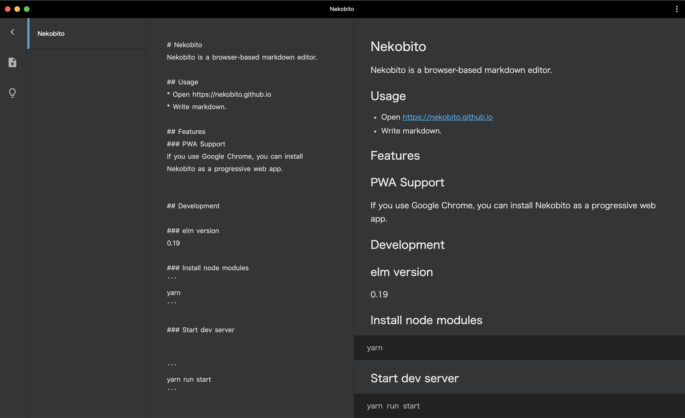

# Nekobito


Nekobito is a browser-based markdown editor.



## Usage
* Open https://nekobito.netlify.com
* Write markdown.

## Features
### PWA Support
If you use Google Chrome, you can install Nekobito as a progressive web app.

## Development

### elm version
0.19

### Install node modules
```
npm i
```

### Start dev server


```
npm run start
```

### Build
```
npm run build
```
